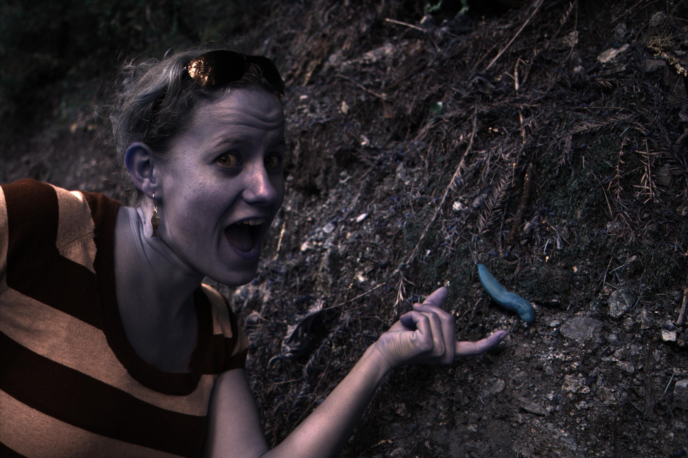
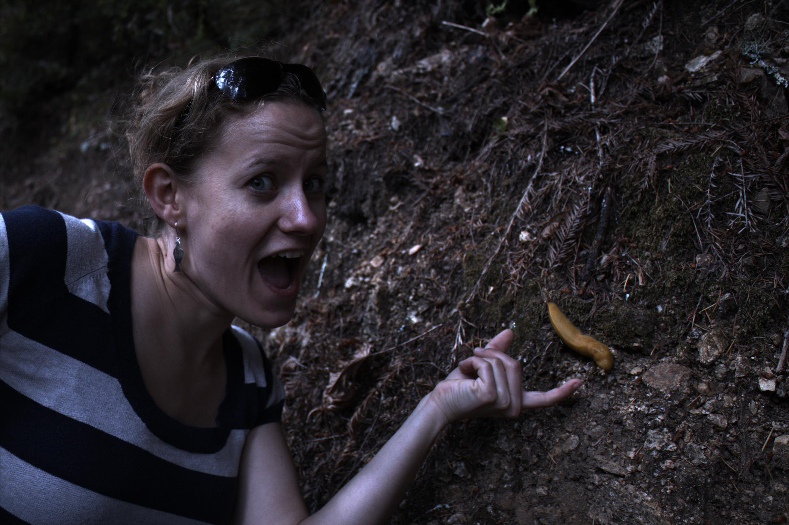

# Assignment 1 - IMPLEMENT A BASIC IMAGE PROCESSING PIPELINE
> Student ID: 20233477 
> Name: Hyogon Ryu (유효곤)

## INITIALS (5 PTS)

### code

```matlab
%%%%%
% initials
fprintf("====================\n");
fprintf("1. INITIALS (5pts)\n");
banana_image = imread('./data/banana_slug.tiff');
s = size(banana_image);
width = s(1);
height = s(2);

fprintf("width : %d, height : %d\n", width, height);
fprintf("class : %s\n", class(banana_image));
fprintf("The image has 16 bits per int.\n");

banana_image = double(banana_image);
```

### output

```
====================
1. INITIALS (5pts)
width : 2856, height : 4290
class : uint16
The image has 16 bits per int.
```


## LINEARIZATION (5 PTS)

### code

```matlab
%%%%%
% Linearization
fprintf("====================\n");
fprintf("Linearization (5pts)\n");

banana_image = (banana_image - 2047) / (15000 - 2047);
tmp = banana_image < 0;
banana_image(tmp) = 0;
tmp = banana_image > 1;
banana_image(tmp) = 1;
fprintf("min value of img: %f\n", min(min(banana_image)));
fprintf("max value of img: %f\n", max(max(banana_image)));
```

### output

```
====================
Linearization (5pts)
min value of img: 0.000000
max value of img: 1.000000
```


## IDENTIFYING THE CORRECT BAYER PATTERN(20 PTS)

### code

```matlab
%%%%%
% Identifying the Correct Bayer Pattern (20pts)
figure;
fprintf("====================\n");
fprintf("Identifying the Correct Bayer Pattern (20pts)\n");

banana_image(1:2,1:2)
fprintf("Since the second and third values bigger than the others, Approximately twice, So I'll divide this values by 2\n");

fprintf("1. grbg\n");
im1 = banana_image(1:2:end, 1:2:end); % g
im2 = banana_image(1:2:end, 2:2:end); % r
im3 = banana_image(2:2:end, 1:2:end); % b
im4 = banana_image(2:2:end, 2:2:end); % g

im_grbg = cat(3, im2, im1, im3);
subplot(1,4,1); imshow(im_grbg * 5);title('grbg');
imwrite(im_grbg * 5, "./asset/fig1-grbg.jpg");

fprintf("2. rggb\n");
im1 = banana_image(1:2:end, 1:2:end); % r
im2 = banana_image(1:2:end, 2:2:end); % g
im3 = banana_image(2:2:end, 1:2:end); % g
im4 = banana_image(2:2:end, 2:2:end); % b

im_rggb = cat(3, im1, im2/2, im4);
subplot(1,4,2); imshow(im_rggb * 5);title('rggb');
imwrite(im_rggb * 5, "./asset/fig1-rggb.jpg");

fprintf("3. bggr\n");
im1 = banana_image(1:2:end, 1:2:end); % b
im2 = banana_image(1:2:end, 2:2:end); % g
im3 = banana_image(2:2:end, 1:2:end); % g
im4 = banana_image(2:2:end, 2:2:end); % r

im_bggr = cat(3, im4, im2/2, im1);
subplot(1,4,3); imshow(im_bggr * 5);title('bggr');
imwrite(im_bggr * 5, "./asset/fig1-bggr.jpg");

fprintf("4. gbrg\n");
im1 = banana_image(1:2:end, 1:2:end); % g
im2 = banana_image(1:2:end, 2:2:end); % b
im3 = banana_image(2:2:end, 1:2:end); % r
im4 = banana_image(2:2:end, 2:2:end); % g

im_gbrg = cat(3, im3, im1, im2);
subplot(1,4,4); imshow(im_gbrg * 5);title('gbrg');
imwrite(im_gbrg * 5, "./asset/fig1-gbrg.jpg");

fprintf("rggb is right\n");
```

### output

```
====================
Identifying the Correct Bayer Pattern (20pts)

ans =

    0.0131    0.0266
    0.0278    0.0125

Since the second and third values bigger than the others, Approximately twice, So I'll divide this values by 2
1. grbg
2. rggb
3. bggr
4. gbrg
rggb is right
```

<figure>
	
	
	
	
</figure>


## WHITE BALANCING (20 PTS)

### code

```matlab
%%%%%
% White Balancing
% 1. Gray world automatic white balancing
fprintf("====================\n");
fprintf("1. Gray world automatic white balancing\n");
im_w_r = banana_image(1:2:end, 1:2:end); % r
im_w_g1 = banana_image(1:2:end, 2:2:end); % g
im_w_g2 = banana_image(2:2:end, 1:2:end); % g
im_w_b = banana_image(2:2:end, 2:2:end); % b

im_w_r = im_w_r * (mean(mean(im_w_g1)) + mean(mean(im_w_g2)))/2 / mean(mean(im_w_r));
im_w_b = im_w_b * (mean(mean(im_w_g1)) + mean(mean(im_w_g2)))/2 / mean(mean(im_w_b));


% 2. White world automatic white balancing
fprintf("2. White world automatic white balancing\n");
im_g_r = banana_image(1:2:end, 1:2:end); % r
im_g_g1 = banana_image(1:2:end, 2:2:end); % g
im_g_g2 = banana_image(2:2:end, 1:2:end); % g
im_g_b = banana_image(2:2:end, 2:2:end); % b

im_g_r = im_g_r * (max(max(im_g_g1)) + max(max(im_g_g2)))/2 / max(max(im_g_r));
im_g_b = im_g_b * (max(max(im_g_g1)) + max(max(im_g_g2)))/2 / max(max(im_g_b));

figure; 
im_w_rgb = cat(3, im_w_r, im_w_g1, im_w_b);
subplot(1,2,1); imshow(im_w_rgb);title('After white balancing (WHITE WORLD)');
imwrite(im_w_rgb, "./asset/fig2-whiteworld.jpg");

im_g_rgb = cat(3, im_g_r, im_g_g1, im_g_b);
subplot(1,2,2);imshow(im_g_rgb);title('After white balancing (GREY WORLD)');
imwrite(im_g_rgb, "./asset/fig2-greyworld.jpg");
```

### output

```
====================
1. Gray world automatic white balancing
2. White world automatic white balancing
```

<figure>
	
	
	
	
</figure>


## DEMOSAICING (25 PTS)

### code

```matlab
%%%%%
fprintf("Demosaicing\n");
im_w_r = interp2(im_w_r);
im_w_g = interp2((im_w_g1 + im_w_g2)/2);
im_w_b = interp2(im_w_b);

im_g_r = interp2(im_g_r);
im_g_g = interp2((im_g_g1 + im_g_g2)/2);
im_g_b = interp2(im_g_b);

figure; 
im_w_rgb = cat(3, im_w_r, im_w_g, im_w_b);
subplot(1,2,1); imshow(im_w_rgb);title('After Demosaicing (WHITE WORLD)');
imwrite(im_w_rgb, "./asset/fig3-whiteworld.jpg");
im_g_rgb = cat(3, im_g_r, im_g_g, im_g_b);
subplot(1,2,2);imshow(im_g_rgb);title('After Demosaicing (GREY WORLD)');
imwrite(im_g_rgb, "./asset/fig3-greyworld.jpg");
```

### output

```
====================
Demosaicing
```

<figure>
	
	
	
	
</figure>


## BRIGHTNESS ADJUSTMENT AND GAMMA CORRECTION (20 PTS)

### code

```matlab
%%%%%
% Brightness Adjustment and Gamma Correction
fprintf("Brightness Adjustment and Gamma Correction\n");

% Brightness Adjustment
gray_img = rgb2gray(im_g_rgb); % Use Grey Assumption Here
max_gray = max(max(gray_img));

scaling_percentage = [100 110 120 130 140 150]; % Change this as needed
figure;
for l = 1:6
    scaled_img = im_g_rgb / max_gray * (scaling_percentage(l)/100);
   

    % gamma correction
    linear_threshold = 0.0031308;
    gamma = 2.4;
    A = 0.055;
    gamma_corrected_img = zeros(size(scaled_img));
    for i = 1:size(scaled_img, 1)
        for j = 1:size(scaled_img, 2)
            for k = 1:3
                Clinear = scaled_img(i,j,k);
                if (Clinear <= linear_threshold)
                    Cnon_linear = 12.92 * Clinear;
                else
                    Cnon_linear = (1 + A) * power(Clinear, 1/gamma) - A;
                end
                gamma_corrected_img(i,j,k) = Cnon_linear;
            end
        end
    end

    subplot(4,3,l);imshow(gamma_corrected_img); title(sprintf('Gamma Corrected (with Scaling %d persentage) (GREY)', scaling_percentage(l)));
    imwrite(gamma_corrected_img, sprintf("./asset/fig4-GAMMA-Scaling(%d)-GREY.jpg", scaling_percentage(l)));
end


% Brightness Adjustment
gray_img = rgb2gray(im_w_rgb); % Use White Assumption Here
max_gray = max(max(gray_img));

scaling_percentage = [100 110 120 130 140 150]; % Change this as needed
for l = 1:6
    scaled_img = im_w_rgb / max_gray * (scaling_percentage(l)/100);
   

    % gamma correction
    linear_threshold = 0.0031308;
    gamma = 2.4;
    A = 0.055;
    gamma_corrected_img = zeros(size(scaled_img));
    for i = 1:size(scaled_img, 1)
        for j = 1:size(scaled_img, 2)
            for k = 1:3
                Clinear = scaled_img(i,j,k);
                if (Clinear <= linear_threshold)
                    Cnon_linear = 12.92 * Clinear;
                else
                    Cnon_linear = (1 + A) * power(Clinear, 1/gamma) - A;
                end
                gamma_corrected_img(i,j,k) = Cnon_linear;
            end
        end
    end

    subplot(4,3,l+6);imshow(gamma_corrected_img); title(sprintf('Gamma Corrected (with Scaling %d persentage) (White)', scaling_percentage(l)));
    imwrite(gamma_corrected_img, sprintf("./asset/fig4-GAMMA-Scaling(%d)-WHITE.jpg", scaling_percentage(l)));
end

scaled_img = im_g_rgb / max_gray * (140/100);
```

### output

```
====================
Demosaicing
```

<figure>
	
	
	
	
</figure>


## COMPRESSION (20 PTS)

### code

```matlab
%%%%%
% Compression
fprintf("Compression\n");
imwrite(scaled_img, "./result/banana.png");
imwrite(scaled_img, "./result/banana.jpg");
imwrite(scaled_img, "./result/banana_q10.jpg", "Quality", 10);
```

### output

```
====================
Compression
```

1. Difference between two files?
2. The compression ratio is the ratio between the size of the uncompressed file  (in bytes) and the size of the compressed file (in bytes). What is the compression  ratio? 
3. By changing the JPEG quality settings, determine the lowest setting for which the  compressed image indistinguishable from the original. What is the compression ratio?

