# Assignment#3 Poisson Blending


Author: Hyogon Ryu (20233477)

All figures images files can find on here

## Implement Poisson Blending

I followed this equation, and I highlighted the important point of the implementation.


> Error : there is the error on eq(1), eq should be the $\text{argmin}$ ( not $\text{argmax}$ )
   $$
   v = \mathbf{argmin}_v \text{ Equation }
   $$
   


#### Main Skeleton code
I use the starter.m as the main code
```matlab

%% Toy Problem
clear
% Load the source image
s = imread('./data/toy_problem.png');
s = im2double(s);
[N, M] = size(s);

index = zeros(N, M);
index(1:N*M) = 1: N*M;

A = zeros( (N-1)*M + N*(M-1) + 1, N*M);
b = zeros((N-1)*M + N*(M-1) + 1, 1);

row = 1;
for n=1:N
    for m=1:M-1
        A(row, index(n,m+1)) = 1;
        A(row, index(n,m)) = -1;
        b(row) = s(n, m+1) - s(n,m);
        row = row + 1;
    end
end
for n=1:N-1
    for m=1:M
        A(row, index(n+1,m)) = 1;
        A(row, index(n,m)) = -1;
        b(row) = s(n+1, m) - s(n,m);
        row = row + 1;
    end
end
A(row, index(1,1)) = 1;
b(row) = s(1,1);

A = sparse(A);

v = A\b;
v_img = reshape(v, [N,M]);
figure; imshow(v_img); title("TOY PROBLEM");

disp(['Error: ' num2str(sqrt(sum(s(:)-v_img(:))))])

%% Poisson Blending

% starter script for project 3
DO_BLEND = true;
DO_MIXED  = false;
DO_COLOR2GRAY = false;

if DO_BLEND
    im_background = imresize(im2double(imread('./data/hiking.jpg')), 0.5, 'bilinear');
    im_object = imresize(im2double(imread('./data/penguin-chick.jpeg')), 0.5, 'bilinear');

    % get source region mask from the user
    objmask = getMask(im_object);
    % align im_s and mask_s with im_background
    [im_s, mask_s] = alignSource(im_object, objmask, im_background);

    % blend
    im_blend = poissonBlend(im_s, mask_s, im_background);
    figure(3), hold off, imshow(im_blend), title("RESULT");
end

if DO_MIXED
    % read images
    %...
    
    % blend
    im_blend = mixedBlend(im_s, mask_s, im_bg);
    figure(3), hold off, imshow(im_blend);
end

if DO_COLOR2GRAY
    im_rgb = im2double(imread('./samples/colorBlindTest35.png'));
    im_gr = color2gray(im_rgb);
    figure(4), hold off, imagesc(im_gr), axis image, colormap gray
end
```


   


### Toy Problem
#### code
```matlab

%% Toy Problem
clear
% Load the source image
s = imread('./data/toy_problem.png');
s = im2double(s);
[N, M] = size(s);

index = zeros(N, M);
index(1:N*M) = 1: N*M;

A = zeros( (N-1)*M + N*(M-1) + 1, N*M);
b = zeros((N-1)*M + N*(M-1) + 1, 1);

row = 1;
for n=1:N
    for m=1:M-1
        A(row, index(n,m+1)) = 1;
        A(row, index(n,m)) = -1;
        b(row) = s(n, m+1) - s(n,m);
        row = row + 1;
    end
end
for n=1:N-1
    for m=1:M
        A(row, index(n+1,m)) = 1;
        A(row, index(n,m)) = -1;
        b(row) = s(n+1, m) - s(n,m);
        row = row + 1;
    end
end
A(row, index(1,1)) = 1;
b(row) = s(1,1);

A = sparse(A);

v = A\b;
v_img = reshape(v, [N,M]);
figure; imshow(v_img); title("TOY PROBLEM");

disp(['Error: ' num2str(sqrt(sum(s(:)-v_img(:))))])
```

I followed the intruction.

#### output
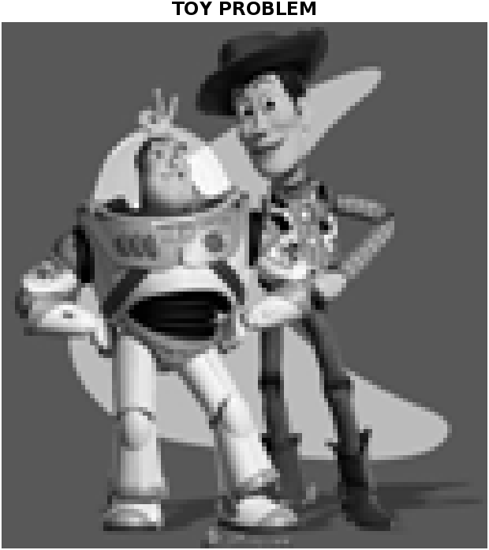

### Poisson Blending
#### code
```matlab
function [im_blend] = poissonBlend(im_s, mask_s, im_background)

disp(["source size:" size(im_s)]);
disp(["mask size:" size(mask_s)]);
disp(["background size:" size(im_background)]);

figure(10);
subplot(1,3,1); imshow(im_s); title("source"); 
subplot(1,3,2); imshow(mask_s); title("mask");
subplot(1,3,3); imshow(im_background); title("background");

[N,M,C] = size(im_s);

index = zeros(N, M);
index(1:N*M) = 1: N*M;
v_img = zeros(N, M, C);

masks = sum(sum(mask_s));

for c=1:C
    
    A = sparse(8*masks, N*M);
    b = zeros(8*masks, 1);

    row = 1;
    for n=1:N
        for m=1:M
            if mask_s(n,m) == 1
                A(row, index(n,m)) = 1;
                A(row, index(n,m+1)) = -1;
                b(row) = im_s(n,m,c) - im_s(n,m+1,c);
                row = row + 1;
                A(row, index(n,m)) = 1;
                A(row, index(n,m-1)) = -1;
                b(row) = im_s(n,m,c) - im_s(n,m-1,c);
                row = row + 1;
                A(row, index(n,m)) = 1;
                A(row, index(n+1,m)) = -1;
                b(row) = im_s(n,m,c) - im_s(n+1,m,c);
                row = row + 1;
                A(row, index(n,m)) = 1;
                A(row, index(n-1,m)) = -1;
                b(row) = im_s(n,m,c) - im_s(n-1,m,c);
                row = row + 1;
            end
        end
    end

    for n=1:N
        for m=1:M
            if mask_s(n,m) == 1
                if mask_s(n,m + 1) == 0
                    A(row, index(n,m)) = 1;
                    b(row) = im_s(n,m,c) - im_s(n,m+1,c) + im_background(n, m+1,c);
                    row = row + 1;
                end
                if mask_s(n,m - 1) == 0
                    A(row, index(n,m)) = 1;
                    b(row) = im_s(n,m,c) - im_s(n,m-1,c) + im_background(n, m-1,c);
                    row = row + 1;
                end
                if mask_s(n+1,m) == 0
                    A(row, index(n,m)) = 1;
                    b(row) = im_s(n,m,c) - im_s(n+1,m,c) + im_background(n+1, m,c);
                    row = row + 1;
                end
                if mask_s(n-1, m) == 0
                    A(row, index(n,m)) = 1;
                    b(row) = im_s(n,m,c) - im_s(n-1,m,c) + im_background(n-1, m,c);
                    row = row + 1;
                end
            end
        end
    end
    disp(row);   
    disp(size(A));
    disp(size(b));
    v = A\b;
    v_img_c = reshape(v, [N,M]);
    v_img(:,:,c) = v_img_c;
end

figure(11); imshow(v_img); title("POISSON Blend");
im_blend = v_img;
im_blend(im_blend == 0) = im_background(im_blend==0);
```

#### output
* penguin-chick

* penguin
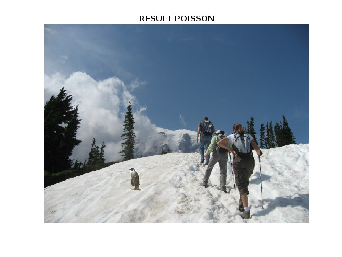

### Blending with Mixed Gradients
#### code
```matlab
function [im_blend] = mixedBlend(im_s, mask_s, im_background)

disp(["source size:" size(im_s)]);
disp(["mask size:" size(mask_s)]);
disp(["background size:" size(im_background)]);

figure(10);
subplot(1,3,1); imshow(im_s); title("source"); 
subplot(1,3,2); imshow(mask_s); title("mask");
subplot(1,3,3); imshow(im_background); title("background");

[N,M,C] = size(im_s);

index = zeros(N, M);
index(1:N*M) = 1: N*M;
v_img = zeros(N, M, C);

masks = sum(sum(mask_s));

for c=1:C
    
    A = sparse(8*masks, N*M);
    b = zeros(8*masks, 1);

    row = 1;
    for n=1:N
        for m=1:M
            if mask_s(n,m) == 1
                for delta = [-1 1]
                    A(row, index(n,m)) = 1;
                    A(row, index(n,m+delta)) = -1;
                    b(row) = im_s(n,m,c) - im_s(n,m+delta,c);
                    row = row + 1;
                
                    A(row, index(n,m)) = 1;
                    A(row, index(n+delta,m)) = -1;
                    b(row) = im_s(n,m,c) - im_s(n+delta,m,c);
                    row = row + 1;
                end
            end
        end
    end

    for n=1:N
        for m=1:M
            if mask_s(n,m) == 1
                for delta = [-1 1]
                    if mask_s(n, m+delta) ==0
                        A(row, index(n,m)) = 1;
                        b(row) = LargerGradient(im_s, im_background, [n m c], [n m+delta c]) + im_background(n, m+delta, c);
                        row = row + 1;
                    end
                    
                    if mask_s(n+delta, m) == 0
                        A(row, index(n,m)) = 1;
                        b(row) = LargerGradient(im_s, im_background, [n m c], [n+delta m c]) + im_background(n+delta, m, c);
                        row = row + 1;
                    end
                end
            end
        end
    end
    disp(row);   
    disp(size(A));
    disp(size(b));
    v = A\b;
    v_img_c = reshape(v, [N,M]);
    v_img(:,:,c) = v_img_c;
end

figure(11); imshow(v_img); title("Mixed Blend");
im_blend = v_img;
im_blend(im_blend == 0) = im_background(im_blend==0);
```

#### output
* penguin-chick

* penguin
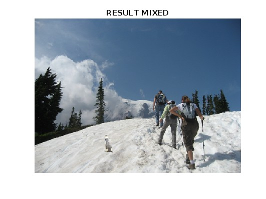


### My Own Examples


#### result1
* input
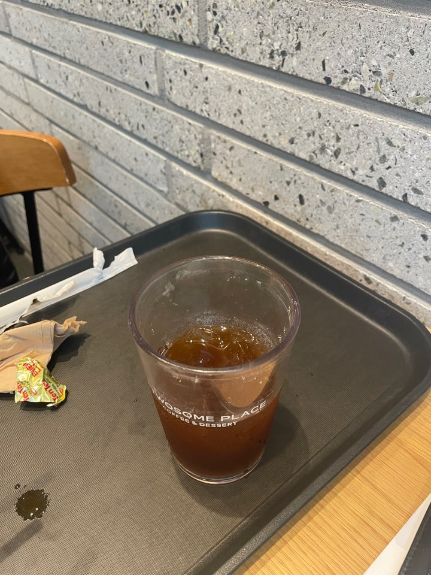
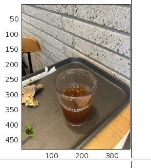
* backgorund
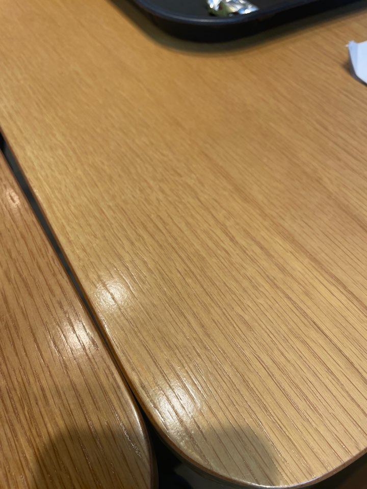
* output
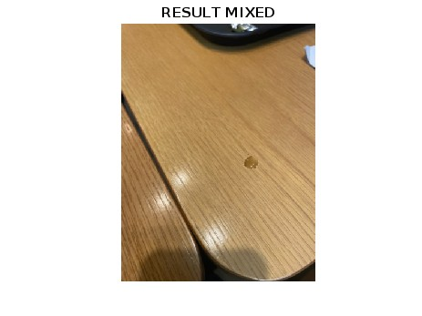

#### result2
* input
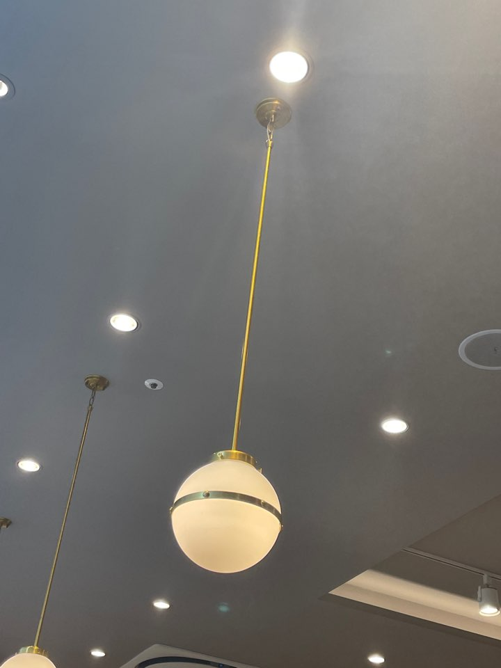
* backgorund
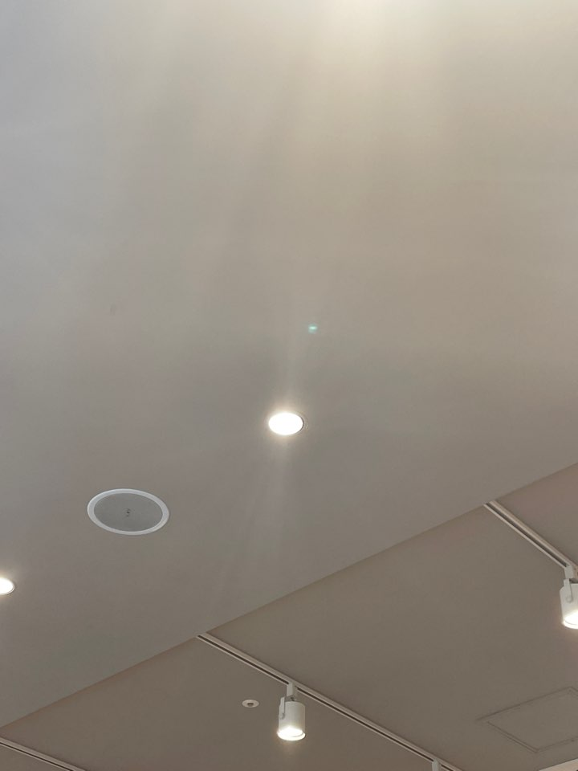
* output
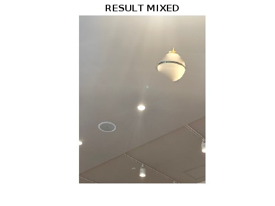

#### result3
* input
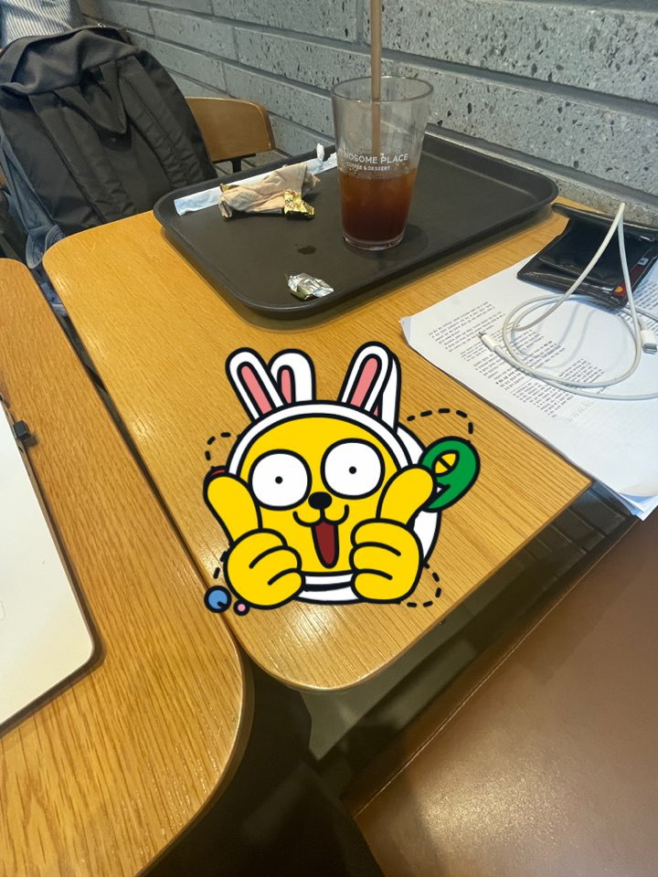
* backgorund
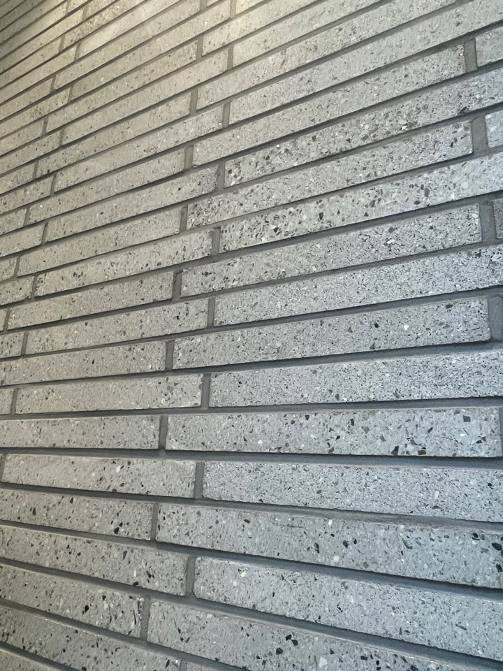
* output
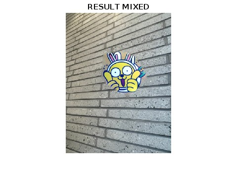

#### Comments
I tried many types of images and 
